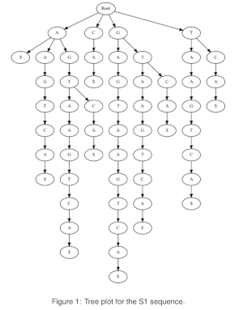

# Suffix Trie Construction

## Overview

This project explores the construction of suffix tries from suffix arrays of DNA sequences. The goal is to analyze how the complexity of a DNA sequence affects the size and structure of its suffix trie.

## Key Concepts

- **Suffix Tries**: Tree-like data structures used to represent all suffixes of a given string.
- **Suffix Arrays**: Sorted lists of all suffixes of a string, used as a basis for constructing suffix tries.
- **Sequence Complexity**: The analysis focuses on how different sequences (with varying lengths and substrings) influence the structure of the suffix trie.

## Applications of Suffix Tries

Suffix tries are highly useful in various fields, including:

- **Bioinformatics**: For sequence alignment, genome assembly, and motif finding in DNA sequences.
- **Text Processing**: Efficiently searching for patterns and substrings within large text datasets.
- **Data Compression**: Identifying repeated patterns to achieve better compression ratios.
- **Computational Biology**: Analyzing genetic sequences to identify genes, regulatory elements, and mutations.

## Example Data and Outputs

### Example Sequences

1. **Sequence S1**: "GAGTAAGTCA"
   - **Suffixes**:
     ```
     [('A\$', 9), ('AAGTCA\$', 4), ('AGTAAGTCA\$', 1), ('AGTCA\$', 5),
     ('CA\$', 8), ('GAGTAAGTCA\$', 0), ('GTAAGTCA\$', 2), ('GTCA\$', 6),
     ('TAAGTCA\$', 3), ('TCA\$', 7)]
     ```
   - **Suffix Trie**:
     

2. **Sequence S2**: "GAGTAAGTCA"
   - **Suffixes**:
     ```
     [('AC\$', 8), ('ACGTAC\$', 4), ('ACGTACGTAC\$', 0), ('C\$', 9), ('CGTAC\$', 5),
     ('CGTACGTAC\$', 1), ('GTAC\$', 6), ('GTACGTAC\$', 2), ('TAC\$', 7),
     ('TACGTAC\$', 3)]
     ```
   - **Suffix Trie**:
     ![Suffix Trie for S2]
     (visualizations/SufTr2.png)

3. **Sequence S3**: "GCTAAAAAAG"
   - **Suffixes**:
     ```
     [('AAAAAAG\$', 3), ('AAAAAG\$', 4), ('AAAAG\$', 5), ('AAAG\$', 6), ('AAG\$', 7),
     ('AG\$', 8), ('CTAAAAAAG\$', 1), ('G\$', 9), ('GCTAAAAAAG\$', 0), ('TAAAAAAG\$', 2)]
     ```
   - **Suffix Trie**:
     
     
## Tools Used

- **Python**: The primary programming language used for implementation.
- **Graphviz**: Used for visualizing the suffix tries.

## Repository Structure

- **code/**: Contains the Python scripts for generating suffixes, building the trie, and visualizing it.
- **data/**: Includes example DNA sequences used in the analysis.
- **documentation/**: Detailed reports and findings from the analysis.
- **README.md**: This file, providing an overview of the project.

## Setup Instructions

1. **Clone the Repository**:
   ```bash
   git clone https://github.com/GiorgosKots/Bioinformatics-Master-s-Projects.git
   cd Bioinformatics-Master-s-Projects/Suffix-Trie-Construction

2. **Install Dependencies**:
   ```bash
   pip install graphviz

3. **Run the Code**:
   ```bash
   python code/suffix_trie_builder.py

4. **Custom Usage**:
   You can modify the sequence variable in the script or pass it as an argument to the main function for different inputs.
